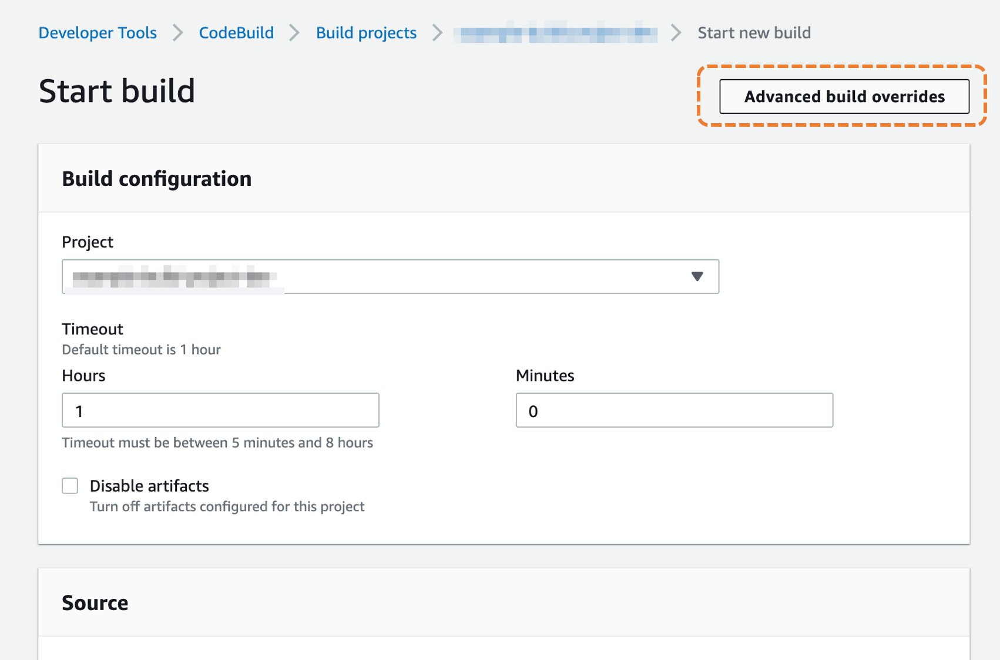
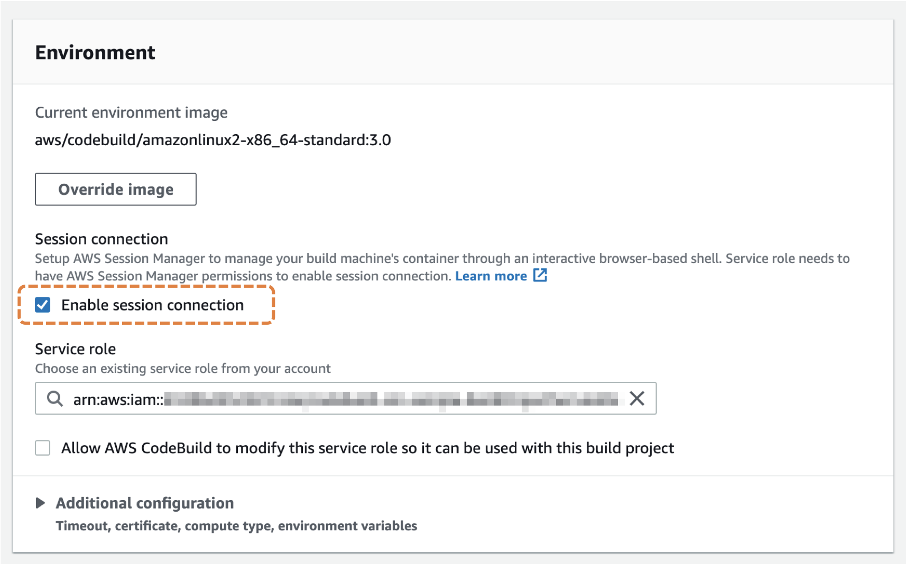
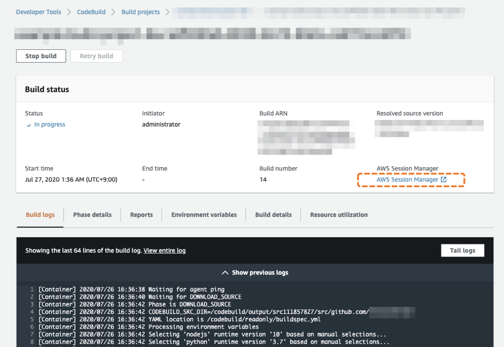
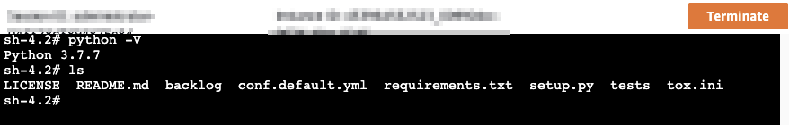

# How to try it?

## (Optional) Edit buildspec

Edit buildspec property ( `BuildProjectPolicy.Properties.Source.BuildSpec` ) if you would like to use your project specific buildspec. If you already have buildspec.yml in your repository, remove above property.

Currently the buildspec written in the sample source, it's assuming targets for python3 project. It executes unittest at build phase.


## Deploy stack

```bash
aws cloudformation deploy \
    --stack-name <your-stack-name> \
    --template-file codebuild-stack.yml \
    --parameter-overrides TargetRepositoryUrl=<your-github-repository-url> \
    --capabilities CAPABILITY_IAM
```

## Start build

We will start build job at management console manually here.

Login to AWS Management Console, then move to CodeBuild, select your build project created a moment ago.

Click `Start Build` .



Check `Enable session connection` .



Note: You don't need to enable _Allow AWS CodeBuild to modify this service role so it can be used with this build project_ . The service role attached your Build project already has necessary permission in this sample.

Scroll down, then click `Start build` .

## Enter into Session Manager's session

In this example, the build job will pauses at "build" phase by `codebuild-breakpoint`  command.

Wait a munite at build status screen. "AWS Session Manager" will appears in build status section. Click this link.



Congrats. you have login to build environment.



## Resume build job

When you complete do youe work, resume build job. enter `codebuild-resume` on session terminal before terminate the session.
